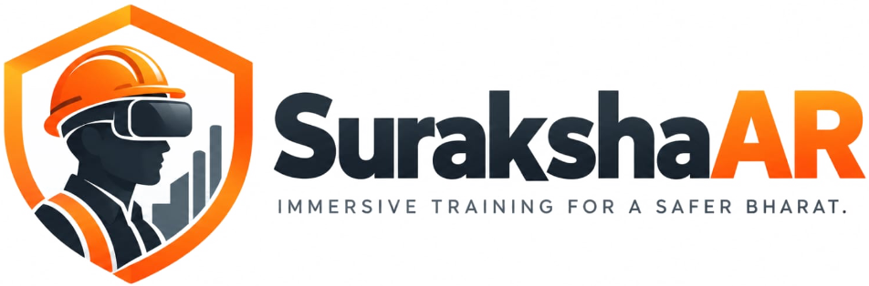
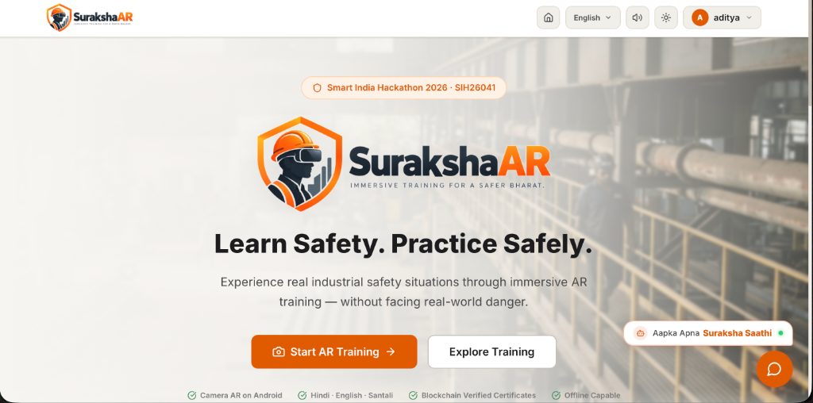

<p align="center">
  
</p>

<p align="center">
  <strong>Immersive Training for a Safer Bharat.</strong><br />
  <em>Smart India Hackathon 2026 · Problem Statement SIH26041</em><br />
  <strong>AR & 3D Vocational Safety Training Simulator for Industrial & Mining Workers</strong>
</p>

<p align="center">
  <a href="https://reactjs.org/"></a>
  <a href="https://vitejs.dev/"></a>
  <a href="https://threejs.org/"></a>
  <a href="https://supabase.com/"></a>
  <a href="#"></a>
  <a href="LICENSE"></a>
</p>

<br />

<p align="center">
  
</p>

---

## 📌 Problem Context

Industrial workers and vocational trainees across Jharkhand’s mining, steel, and manufacturing sectors operate in hazardous high-risk environments. Traditional classroom training often fails to build real situational muscle memory, while hands-on emergency drills carry high logistical costs and genuine physical risks.

**SurakshaAR** bridges this critical gap by delivering mobile-first, immersive augmented reality safety simulations directly on standard Android smartphones without requiring expensive specialized headsets.

---

## 🌟 Live Experience & Highlights

- 📱 **Camera AR Mode**: Live camera passthrough with 3D hazard overlays and interactive emergency response sequences.
- 🕹️ **Interactive 3D Simulation**: Full 360° rotational simulation with OrbitControls, directional D-pad, and smooth camera target focusing.
- 🤖 **Aapka Apna Suraksha Saathi**: Dedicated floating safety chatbot with curated industrial regulations and instant voice text-to-speech.
- 🌐 **Trilingual by Design**: Complete accessibility in **English**, **Hindi (हिंदी)**, and **Santali (Ol Chiki ᱥᱟᱱᱛᱟᱲᱤ)**.
- 🔐 **Blockchain Integrity Certificates**: Cryptographic SHA-256 certificate hashing with instant public QR verification.
- 📶 **Offline-First Resilience**: Powered by IndexedDB for uninterrupted training in underground mines or zero-connectivity sites.

---

## ✨ Key Features Detailed

### 1. 📷 Camera AR & 3D Simulation
- **Dual-Mode Experience**:
  - **Camera AR Mode**: Overlays real-time 3D safety hazards, emergency exits, and interactive PPE stations onto the smartphone's live camera feed via `navigator.mediaDevices.getUserMedia` with gyro orientation tracking.
  - **3D Simulation Mode**: Full 3D environment with `OrbitControls` for desktop and non-camera devices.
- **Realistic Hazard Scenarios**:
  - **Fire & Explosion Response** (Manufacturing plant): Alarm activation, electrical fire response, fire-rated PPE station, CO₂ extinguisher selection, fire exits, and muster assembly.
  - **Gas Leak & Confined Space Protocol** (Mining tunnel): Gas detector warning, alarm activation, buddy system enforcement, SCBA breathing apparatus, and evacuation.
  - **Machinery Safety & LOTO** (Lockout/Tagout - upcoming module).

### 2. 🌐 Multilingual Accessibility
- **Trilingual Support**: English, Hindi (हिंदी), and Santali (Ol Chiki script ᱥᱟᱱᱛᱟᱲᱤ).
- **Text-to-Speech (TTS)**: Built-in voice engine for Hindi and Indian English to read out instructions, tutorials, and questions aloud for low-literacy workers.
- **High-Contrast Accessibility Mode**: Single-click toggle for high-visibility industrial lighting conditions.

### 3. 📝 Assessment & Immediate Feedback
- Pre-verified assessment questions per hazard scenario in English, Hindi, and Santali.
- Real-time scoring algorithm based on:
  - Base score: 100 points
  - Deduction: 10 points per missed or incorrect action
  - Time penalty: Scaled deduction if exceeding benchmark completion time
  - PPE bonus: +5 points for 100% correct PPE donning discipline
- Passing threshold: 60%.

### 4. 🔐 Cryptographic Certificates & QR Verification
- **Tamper-Proof Integrity**: Generates a canonical payload of certificate metadata hashed using SHA-256 via the browser-native `crypto.subtle.digest` API.
- **Embedded QR Code**: Each certificate contains a scannable QR code directing to `/verify/:certNumber`.
- **Public Verification Portal**: Accessible to safety inspectors without login; re-calculates the cryptographic hash against stored records to detect forgery or tampering.
- **Downloadable**: Generates high-resolution PNG certificates via `html-to-image`.

### 5. 📡 Offline-First Architecture
- Powered by **IndexedDB** (`idb` library).
- Allows trainees to complete modules in underground mines or low-connectivity zones.
- Training sessions and action logs are queued locally and automatically synchronized with the server when network connectivity is restored.

### 6. 🤖 Curated Safety Knowledge Assistant
- Non-hallucinatory, deterministic chatbot answering industrial safety queries.
- Keyword and context-matching against a curated repository of 40+ industrial safety regulations.
- Voice read-aloud support for responses.

### 7. 📊 Web Admin & Compliance Portal
- Role-gated dashboard for industrial safety officers.
- Real-time compliance tracking, site-by-site pass rates, and trainee performance metrics.
- Trainee directory with search, filtering, and detailed session history.
- Certificate registry with status auditing and revocation controls.

---

## 🏛️ Project Structure

```
SurakshaAR1/
├── dist/                      # Production build output
├── public/                    # PWA manifest, favicons, shield icon
├── supabase/
│   ├── schema.sql             # PostgreSQL schema with RLS policies & indexes
│   └── seed.sql               # Scenarios & multilingual question bank
├── src/
│   ├── components/
│   │   ├── auth/              # ProtectedRoute & AdminRoute guards
│   │   ├── chatbot/           # SafetyChatbot floating widget
│   │   ├── layout/            # Navbar with lang switcher, voice, contrast
│   │   └── ui/                # OfflineBanner, CompletionPopup
│   ├── contexts/
│   │   ├── AuthContext.jsx    # Auth state with Supabase + mockDb fallback
│   │   ├── LanguageContext.jsx# i18n & font switcher (EN/HI/SAT)
│   │   ├── AccessibilityContext.jsx # High contrast toggle
│   │   └── OfflineContext.jsx # Connectivity & sync queue runner
│   ├── lib/
│   │   ├── blockchain.js      # SHA-256 canonical hashing & verification
│   │   ├── certificate.js     # Certificate issuance & queries
│   │   ├── i18n.js            # Translation strings (EN/HI/SAT)
│   │   ├── indexeddb.js       # Offline queue storage
│   │   ├── mockDb.js          # Out-of-the-box local storage database
│   │   ├── safetyKnowledge.js # Curated safety rules database
│   │   ├── scoring.js         # Benchmark & penalty scoring engine
│   │   ├── supabase.js        # Supabase client & error formatter
│   │   └── voice.js           # Web Speech API TTS & STT wrapper
│   ├── pages/
│   │   ├── admin/             # Admin, AdminTrainees, AdminTraineeDetail,
│   │   │                      # AdminCompliance, AdminCertificates
│   │   ├── Assessment.jsx     # Multilingual quiz engine
│   │   ├── Certificate.jsx    # Certificate viewer & downloader
│   │   ├── Dashboard.jsx      # Trainee hub & KPI overview
│   │   ├── Landing.jsx        # SIH public introduction page
│   │   ├── Login.jsx          # Trainee sign-in
│   │   ├── Profile.jsx        # Trainee settings & session records
│   │   ├── Results.jsx        # Score ring, breakdown, and feedback
│   │   ├── Scenario.jsx       # Camera AR + 3D Simulation Three.js scene
│   │   ├── Signup.jsx         # Trainee registration
│   │   ├── Tutorial.jsx       # 5-step pre-AR guide with voice
│   │   └── Verify.jsx         # Public QR certificate verification
│   ├── App.jsx                # React Router root & Error Boundary
│   ├── index.css              # Design system & CSS custom properties
│   └── main.jsx               # React DOM entrypoint
├── index.html                 # PWA HTML shell with font preloads
├── netlify.toml               # Netlify configuration & security headers
├── package.json
└── vite.config.js
```

---

## ⚡ Getting Started

### Prerequisites
- Node.js (v18+ or v20+)
- npm (v9+)

### Installation
```bash
# Clone or navigate to the project directory
cd /Users/kishananand/Desktop/SurakshaAR1

# Install dependencies (using legacy peer deps for three/fiber compatibility)
npm install --legacy-peer-deps
```

### Running Locally (Zero-Config Demo Mode)
The project includes a full **Mock Database fallback**. If Supabase keys are not present in `.env`, the application seamlessly runs in demo mode using `localStorage` and `IndexedDB`.

```bash
# Start Vite development server
npm run dev
```
Open [http://localhost:5174](http://localhost:5174) in your browser.

#### Demo Credentials:
- **Trainee**: Register any email/password on `/signup` or sign in with any account.
- **Admin**: Log in at `/admin-login` with:
  - **Email:** `admin@suraksha.demo`
  - **Password:** `Admin@1234`

---

## 🔌 Connecting Real Supabase Backend (Optional)

1. Create a project on [supabase.com](https://supabase.com).
2. Run the SQL migrations:
   - Paste the contents of `supabase/schema.sql` into the **SQL Editor** in Supabase and run it.
   - Paste the contents of `supabase/seed.sql` to populate scenarios and assessment questions.
3. Copy `.env.example` to `.env`:
   ```bash
   cp .env.example .env
   ```
4. Fill in your Supabase credentials:
   ```env
   VITE_SUPABASE_URL=https://your-project.supabase.co
   VITE_SUPABASE_ANON_KEY=your-anon-key
   VITE_CHAIN_MODE=local
   ```

---

## 🧪 Verification & Testing

```bash
# Run lint check (oxlint)
npm run lint

# Build for production
npm run build

# Preview production build locally
npm run preview
```

---

## 🚀 Deployment to Netlify

The repository is pre-configured for Netlify via [netlify.toml](file:///Users/kishananand/Desktop/SurakshaAR1/netlify.toml):
- **Build command:** `npm run build`
- **Publish directory:** `dist`
- **SPA Redirection:** `/* -> /index.html 200`
- **Security Headers:** Strict CSP, X-Frame-Options: DENY, and Permissions-Policy enabled for camera & microphone.

To deploy via Netlify CLI:
```bash
npx netlify deploy --prod --dir=dist
```

---

## 🏆 Smart India Hackathon 2026
- **Problem Statement:** SIH26041
- **Domain:** Industrial Safety & Vocational Skill Development
- **Developed for:** State of Jharkhand — Mining, Steel & Manufacturing Workers
